# Stephanie Duffieux's Portfolio 
T1A3 Portfolio Assessment | Coder Academy Brisbane | March 2020 

* [Link to website](https://beedeeboom.github.io/stephanie-duffieux/) - https://beedeeboom.github.io/stephs-portfolio/
* [Link to Github repository](https://github.com/Beedeeboom/portfolio) - https://github.com/Beedeeboom/portfolio

## Purpose of the Website

The purpose of this portfolio website is to showcase my skills, as a developer and IT professional, as well as my experience as a graphic designer to prospective employers.

This website contains samples of my work during my time at Coder Academy as well as graphic design projects created for my clients. It also contains information about myself, my professional experience, my knowledge of programming languages and my blog, which narrates the story of my journey from my beginnings and long term career as an administrative and customer service professional to my new found passion and love for the world of design and web development.

With beginner to intermediate skills in programming, my aim is to continue to build this website as I further develop my skills in web development, and to continue to add elements to my portfolio to create a variety of work samples that I could potentially showcase to my future employers or clients. 

## Target Audience

The website was designed to attract potential employers seeking to employ a developer or IT professional with high expectations of professionalism and a positive work ethic. The target audience would have technical knowledge within the industry of information technology and software development and would expect its prospective employee to have abilities in coding various programming languages and development stacks. The target audience also takes into account its future employee's soft skills, work experience in both programming and other business industries, abilities to adapt to working within a team environment or self directed and flexibiltiy to work on a variety of projects.

## Functionality, Features & Style Guide

The website contains 6 pages:

1. Home page (index.html)
2. About Me page (about.html)
3. Portfolio page (portfolio.html)
4. Resume page (opens PDF in new window)
5. Blog Posts page (blog.html)
6. Contact Me page (contact.html)

#### List of Components

* Call to action on the home page to scroll down and view more of my journey into coding (link opens to pdf in new window)
* Footer contains links to socials (repeated on all pages)
* Contact form on both about and contact page to encourage the user to get in touch
* Recurring header on pages with logo and header to create a sense of consistency
* Navigation bar desktop and mobile view which switches to a hamburger dropdown menu
* Resume page links to pdf in a new window
* Portfolio displays a gallery with work samples and includes a link to full pdf version
* Blog page contains articles and list of most popular items

All pages of the website can be accessed through the navigational menu at the top of each page. 

Links to my professional social accounts, LinkedIn, Github, Twitter, Facebook and Instagram (my freelance business accounts) are also made available to the user within the footer of the website. 
The idea of also showcasing my freelance business within my portfolio, via my social accounts, aims at demonstrating my skills and ability to manage a small business and my experience with client relationships. I feel this feature is an important aspect to showcasing my experience not only as a web developer but also in other aspects of the working industry which are also invaluable skills that could be benefical to potential employers. 

All pages of the website are produced with a responsive layout that will display on desktop, mobile and tablet devices and have been built for accessibility to all users.

A style guide was established to ensure consistency accross all pages which share a common theme. This also establishes a personal branding style that reflects who I am both at a personal and professional level. By using the style guide I can ensure that the fonts, colours and main graphics remain consistent accross the whole website. My personal branding consists of visual branding (professional photos) and my web developer logo. The overall look and feel aims to resonate with my own personality and values. 

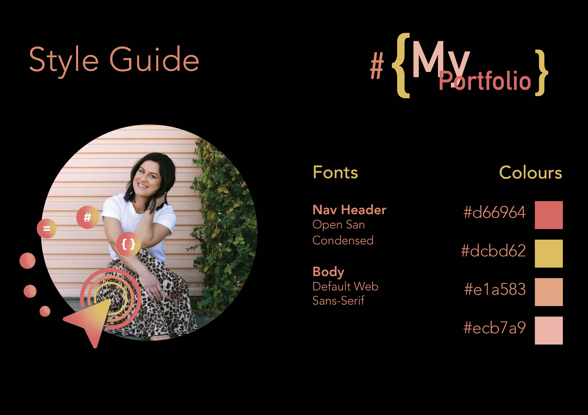

## Sitemap

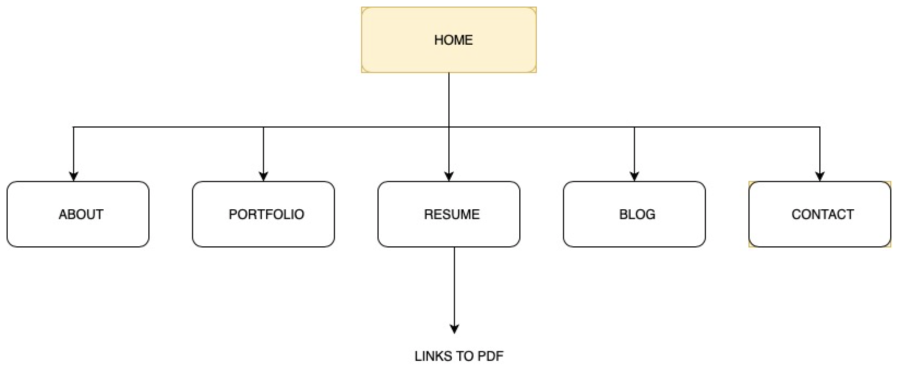

## Wireframe Mock-ups

#### Mobile Wireframes

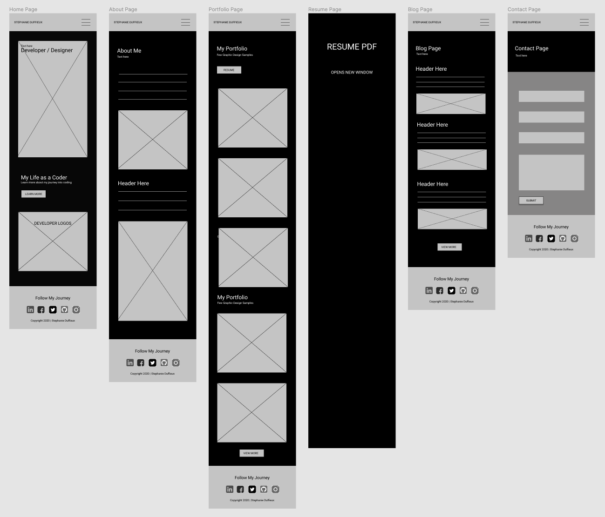

#### Desktop Wireframes

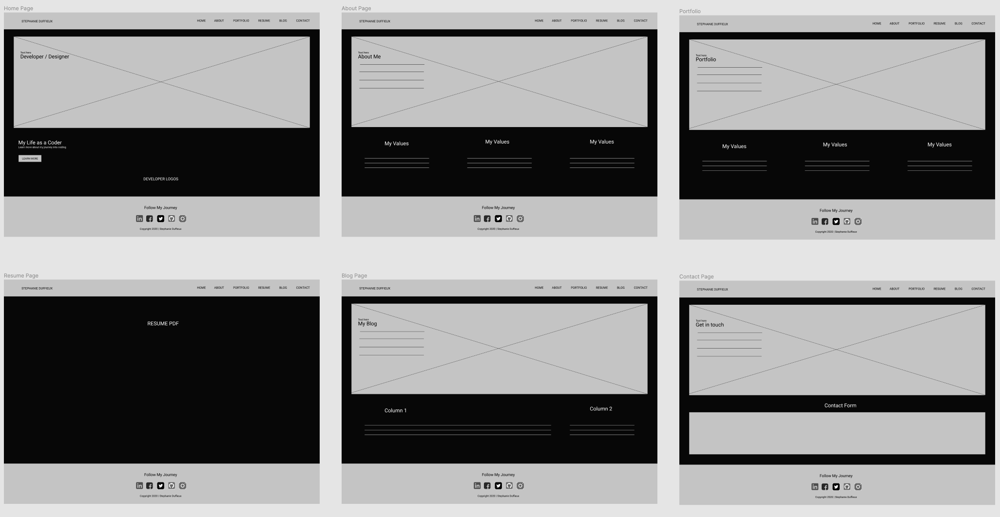

### Figma Board

[Link to Figma board](https://www.figma.com/file/rgKFGXT2xZkddrkDpv6KX9/Untitled?node-id=0%3A1)

## Mobile Screenshots
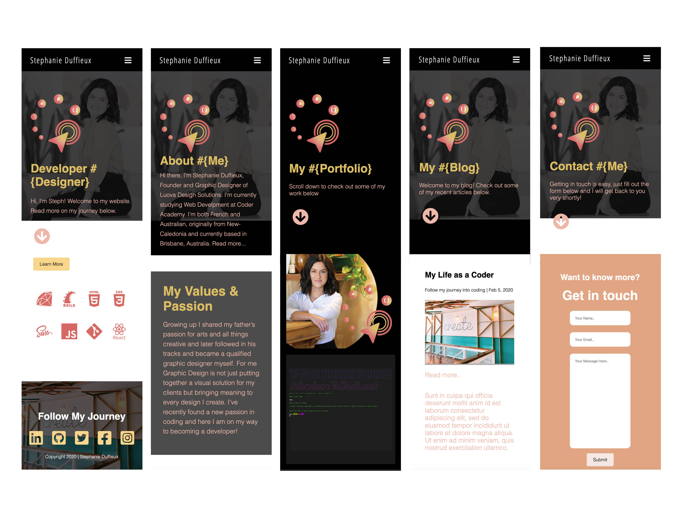

## Desktop Screenshots

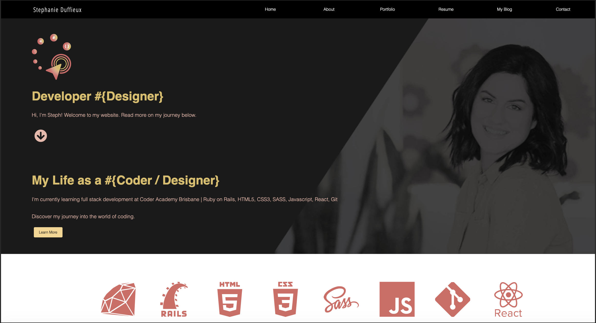
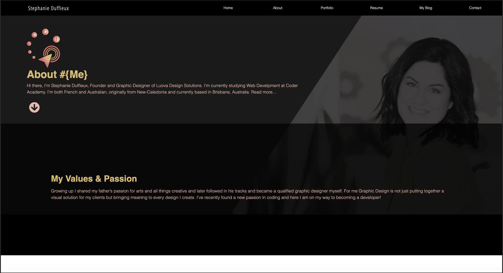
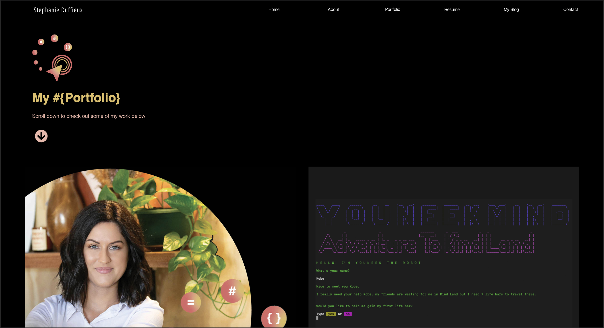
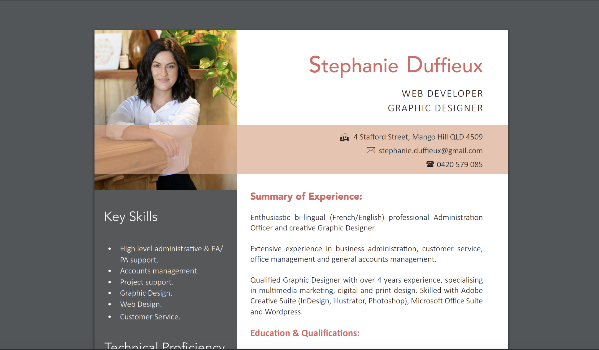
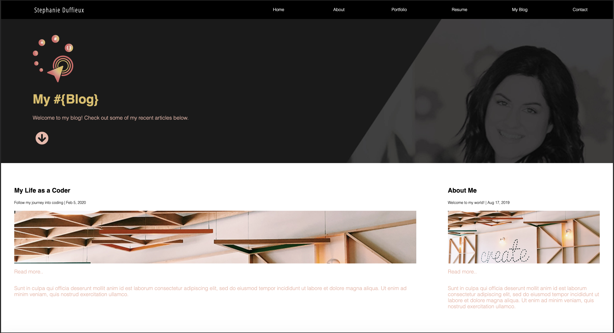
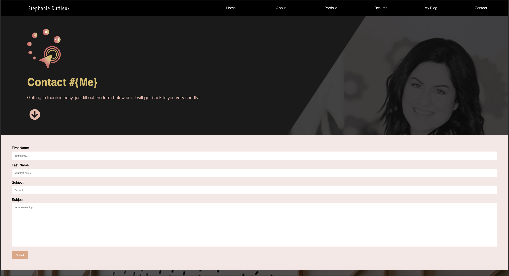

## Tech Stack 

This portfolio was built using:

* HTML
* CSS 
* Visual Studio 
* Adobe Illustrator (vector images) 
* Adobe Indesign for layouts (pdfs)
* Adobe Photoshop (resizing images to web size)
* Github (source control & deployment)
* draw.io (sitemap)
* Google fonts
* Font awesome
* Devicons

